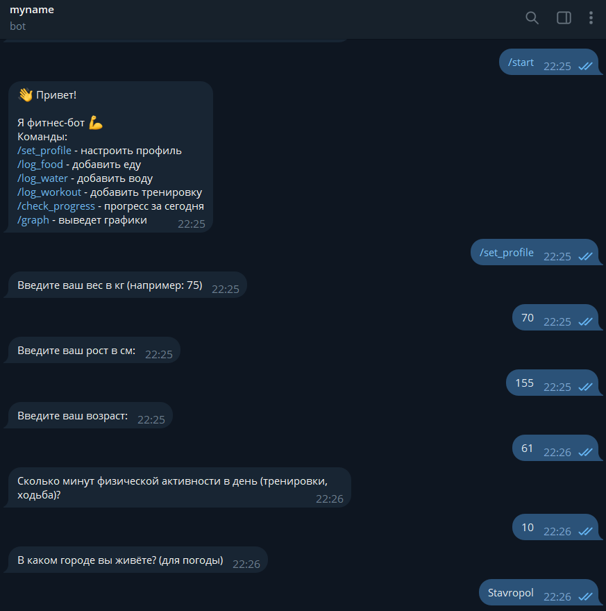
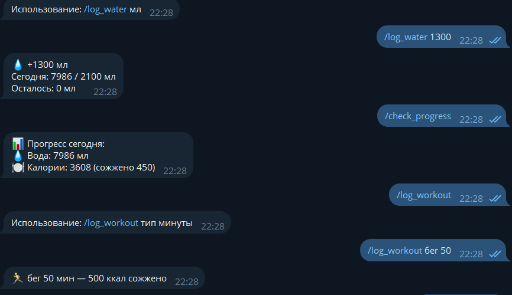
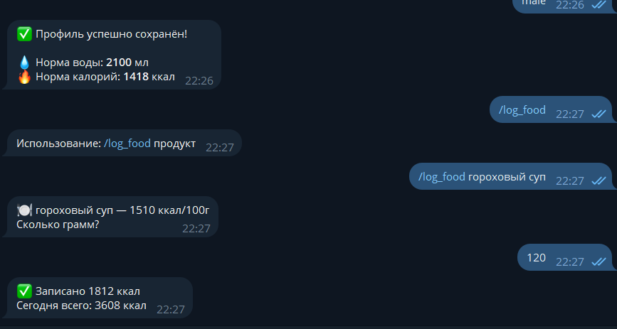
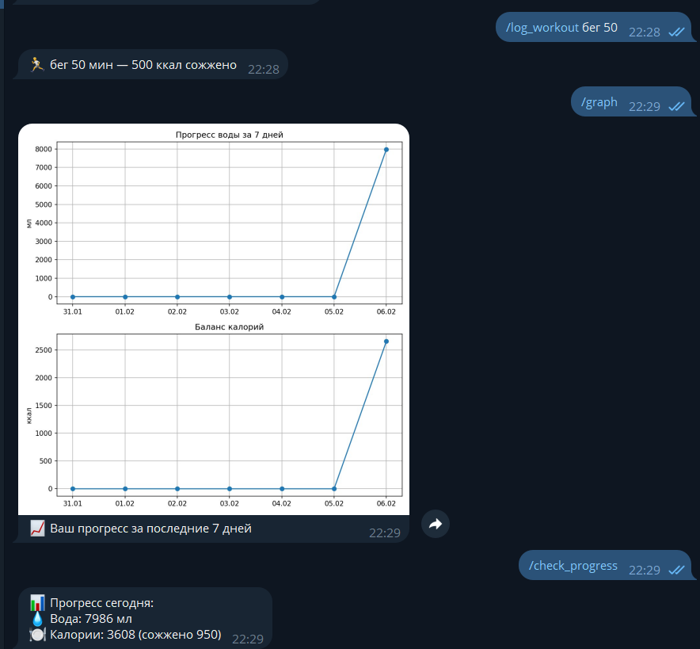
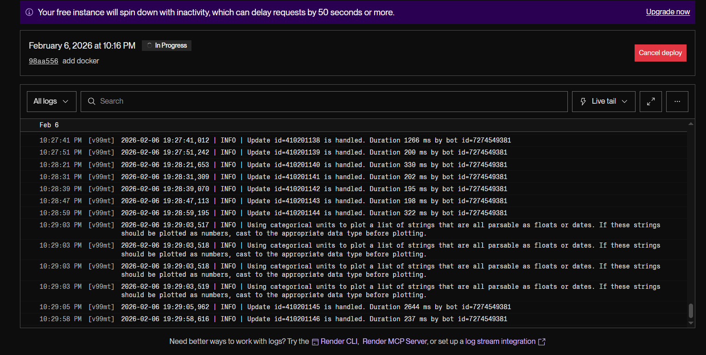

#  Fitness Telegram Bot

Telegram-бот для отслеживания **калорий, воды и прогресса**, с графиками и рекомендациями.
Проект выполнен в рамках учебного задания и развёрнут в Docker.

---

##  Возможности

### Основной функционал
-  Учёт потреблённых **калорий**
- Учёт выпитой **воды**
- Сохранение данных пользователя
- Работа через Telegram-бота

### Дополнительная функциональность
-  **Графики прогресса**
  - График потребления воды
  - График калорий за период
-  **Продвинутое определение калорийности**
  - Расчёт калорий не только по названию, но и с учётом порции / веса

---

##  Примеры работы бота

> Ниже приведены примеры экранов работы бота

### Запуск


### Добавление воды или тренировок


### Добавление еды


### График воды\калорий


### На сервере


## 🐳 Запуск проекта через Docker

### 1. Клонировать репозиторий
```bash
git clone https://github.com/your-username/fitness-bot.git
cd fitness-bot
```


### 2. Создать файл .env

```
DATABASE_URL=sqlite+aiosqlite:///./data/db.sqlite3
TG_TOKEN=token
OPENWEATHER_API_KEY=key
```


### 3.  Собрать и запустить контейнер
```
docker compose up --build
```


### 4.ЗАПУСК ТЕСТОВ В КОНТЕЙНЕРЕ
```
docker exec -it fitness_bot pytest
```
